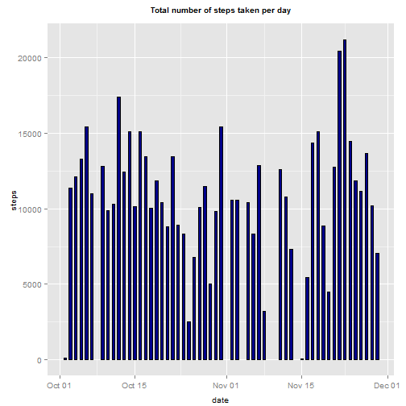
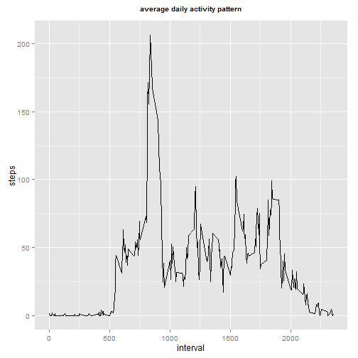
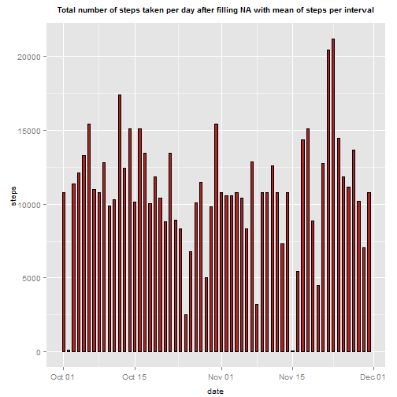

Data Science Courses series:Reproducible Research
====================================================================
Introduction of Peer Assessment 1
---------------------------------

It is now possible to collect a large amount of data about personal movement using activity monitoring devices such as a Fitbit, Nike Fuelband, or Jawbone Up. These type of devices are part of the "quantified self" movement - a group of enthusiasts who take measurements about themselves regularly to improve their health, to find patterns in their behavior, or because they are tech geeks. But these data remain under-utilized both because the raw data are hard to obtain and there is a lack of statistical methods and software for processing and interpreting the data.

This assignment makes use of data from a personal activity monitoring device. This device collects data at 5 minute intervals through out the day. The data consists of two months of data from an anonymous individual collected during the months of October and November, 2012 and include the number of steps taken in 5 minute intervals each day.

Loading and preprocessing the data
----------------------------------
- Download and read read into R

```r
#Set up working directory
setwd("C:/Users/jason/Desktop/Coursera_homeworks/Reproduciable_research")
#download the file from website, unzip, and check the file
fileUrl <- "http://d396qusza40orc.cloudfront.net/repdata%2Fdata%2Factivity.zip"
download.file(fileUrl, destfile = "activity.zip", mode ="wb", method = "auto")
unzip("activity.zip")
#Read the data into R
data <- read.csv("activity.csv", sep=',', header=T)
head(data)
```

```
##   steps       date interval
## 1    NA 2012-10-01        0
## 2    NA 2012-10-01        5
## 3    NA 2012-10-01       10
## 4    NA 2012-10-01       15
## 5    NA 2012-10-01       20
## 6    NA 2012-10-01       25
```
- Generate a new column "d_h_m"

```r
#convert interval time to "%H%M" formate
hr_min <- paste(data$interval %/% 100, data$interval %% 100, sep=":")
#add the converted time into data
d_h_m <- paste(data$date, hr_min)
data$d_h_m <- as.POSIXct(d_h_m)
data$date <-as.Date(data$date)
head(data)
```

```
##   steps       date interval               d_h_m
## 1    NA 2012-10-01        0 2012-10-01 00:00:00
## 2    NA 2012-10-01        5 2012-10-01 00:05:00
## 3    NA 2012-10-01       10 2012-10-01 00:10:00
## 4    NA 2012-10-01       15 2012-10-01 00:15:00
## 5    NA 2012-10-01       20 2012-10-01 00:20:00
## 6    NA 2012-10-01       25 2012-10-01 00:25:00
```
What is mean total number of steps taken per day?
------------------------------------------------
- Make a histogram of the total number of steps taken each day

```r
#calcuate total number of steps for each day
total <- aggregate(steps ~ date, data, sum, na.action = na.omit)
head(total)
```

```
##         date steps
## 1 2012-10-02   126
## 2 2012-10-03 11352
## 3 2012-10-04 12116
## 4 2012-10-05 13294
## 5 2012-10-06 15420
## 6 2012-10-07 11015
```

```r
#plot
library(ggplot2)
```

```
## Warning: package 'ggplot2' was built under R version 3.1.2
```

```r
plot1 <- ggplot(total,aes(x=date,y=steps)) + geom_bar(stat="identity", width=.5, fill="darkblue", colour="black") 
plot1 <- plot1 + ggtitle("Total number of steps taken per day")
plot1+theme(plot.title = element_text(size=10, face="bold", vjust=2))+theme(axis.text.x=element_text(angle=0, size=10, vjust=0.5))+ theme(
      axis.title.x = element_text(color="black", vjust=-0.35, size=10),
      axis.title.y = element_text(color="black" , vjust=0.35, size=10))
```

 
- Calculate and report the mean and median total number of steps taken per day

```r
paste("Mean of steps per day is", mean(total$steps), sep=' ')
```

```
## [1] "Mean of steps per day is 10766.1886792453"
```

```r
paste("Median of steps per day is", median(total$steps), sep=' ')
```

```
## [1] "Median of steps per day is 10765"
```

What is the average daily activity pattern?
------------------------------------------
- Make a time series plot (i.e. type = "l") of the 5-minute interval (x-axis) and the average number of steps taken, averaged across all days (y-axis)


```r
#calculate average number of steps for each interval
ave <- aggregate(steps ~ interval, data, mean, na.action = na.omit)
head(ave)
```

```
##   interval     steps
## 1        0 1.7169811
## 2        5 0.3396226
## 3       10 0.1320755
## 4       15 0.1509434
## 5       20 0.0754717
## 6       25 2.0943396
```

```r
#plot
plot2 <- ggplot(ave, aes(x=interval, y=steps)) + geom_line()
plot2 <- plot2 + ggtitle("average daily activity pattern")
plot2 + theme(plot.title = element_text(size=10, face="bold", vjust=2))
```

 
- Which 5-minute interval, on average across all the days in the dataset, contains the maximum number of steps?

```r
max(ave[,2])
```

```
## [1] 206.1698
```

```r
max_interval <- ave[ which(ave[,2]==max(ave[,2])),]$interval
paste("the maximum numer of steps", max(ave[,2], "is corresponding to the interval", max_interval, sep=" "))
```

```
## [1] "the maximum numer of steps is corresponding to the interval"
```

Imputing missing values
-----------------------
Note that there are a number of days/intervals where there are missing values (coded as NA). The presence of missing days may introduce bias into some calculations or summaries of the data.

- Calculate and report the total number of missing values in the dataset (i.e. the total number of rows with NAs)

```r
summary(data$steps)
```

```
##    Min. 1st Qu.  Median    Mean 3rd Qu.    Max.    NA's 
##    0.00    0.00    0.00   37.38   12.00  806.00    2304
```

```r
sum(is.na(data$steps))
```

```
## [1] 2304
```

```r
paste("The total number of missing values in the dataset is", sum(is.na(data$steps)), sep=" ")
```

```
## [1] "The total number of missing values in the dataset is 2304"
```

- Devise a strategy for filling in all of the missing values in the dataset. The strategy does not need to be sophisticated. For example, you could use the mean/median for that day, or the mean for that 5-minute interval, etc.
Create a new dataset that is equal to the original dataset but with the missing data filled in.

```r
#substitute missing values with mean of steps in each interval
data_new <- data
for (i in c(1:nrow(data))) {
if (is.na(data_new[i,1])) { data_new[i,1] = ave[ which (ave[,1]==data[i,3]),]$steps}}
head(data_new)
```

```
##       steps       date interval               d_h_m
## 1 1.7169811 2012-10-01        0 2012-10-01 00:00:00
## 2 0.3396226 2012-10-01        5 2012-10-01 00:05:00
## 3 0.1320755 2012-10-01       10 2012-10-01 00:10:00
## 4 0.1509434 2012-10-01       15 2012-10-01 00:15:00
## 5 0.0754717 2012-10-01       20 2012-10-01 00:20:00
## 6 2.0943396 2012-10-01       25 2012-10-01 00:25:00
```
- Make a histogram of the total number of steps taken each day and Calculate and report the mean and median total number of steps taken per day. Do these values differ from the estimates from the first part of the assignment? What is the impact of imputing missing data on the estimates of the total daily number of steps?

```r
#calculate total numer of steps taken each day after imputing missing data.
total_new <- aggregate(steps ~ date, data_new, sum)
head(total_new)
```

```
##         date    steps
## 1 2012-10-01 10766.19
## 2 2012-10-02   126.00
## 3 2012-10-03 11352.00
## 4 2012-10-04 12116.00
## 5 2012-10-05 13294.00
## 6 2012-10-06 15420.00
```

```r
#make histogram
library(ggplot2)
plot3 <- ggplot(total_new,aes(x=date,y=steps)) + geom_bar(stat="identity", width=.5, fill="firebrick", colour="black") 
plot3 <- plot3 + ggtitle("Total number of steps taken per day after filling NA with mean of steps per interval")
plot3+theme(plot.title = element_text(size=10, face="bold", vjust=2))+theme(axis.text.x=element_text(angle=0, size=10, vjust=0.5))+ theme(
      axis.title.x = element_text(color="black", vjust=-0.35, size=10),
      axis.title.y = element_text(color="black" , vjust=0.35, size=10))
```

 

```r
#Calculate the mean and median total number of steps taken per day of new data
paste("After filling NA, the mean of steps per day changed", mean(total_new$steps)- mean(total$steps), sep=' ')
```

```
## [1] "After filling NA, the mean of steps per day changed 0"
```

```r
paste("After filling NA, the median of steps per day changed", median(total_new$steps) - median(total$steps), sep=' ')
```

```
## [1] "After filling NA, the median of steps per day changed 1.1886792452824"
```

Are there differences in activity patterns between weekdays and weekends?
--------------------------------------------------------------------------
- For this part the weekdays() function may be of some help here. Use the dataset with the filled-in missing values for this part.

- Create a new factor variable in the dataset with two levels - "weekday" and "weekend" indicating whether a given date is a weekday or weekend day.

```r
#genrate a new column "weekday" to data_new
weekdate <- weekdays(data_new$date)
#substitute "Monday" to "Friday" with "weekday", and "Saturday"& "Sunday"
 for (i in c(1:length(weekdate))) {
 if (weekdate[i]=="Saturday" || weekdate[i]=="Sunday") { weekdate[i] = "weekend"}
 else { 
weekdate[i] = "weekday"}
       }
#add "weekdate" as a new column of data_new
data_new$weekdate <- weekdate
head(data_new)
```

```
##       steps       date interval               d_h_m weekdate
## 1 1.7169811 2012-10-01        0 2012-10-01 00:00:00  weekday
## 2 0.3396226 2012-10-01        5 2012-10-01 00:05:00  weekday
## 3 0.1320755 2012-10-01       10 2012-10-01 00:10:00  weekday
## 4 0.1509434 2012-10-01       15 2012-10-01 00:15:00  weekday
## 5 0.0754717 2012-10-01       20 2012-10-01 00:20:00  weekday
## 6 2.0943396 2012-10-01       25 2012-10-01 00:25:00  weekday
```

- Make a panel plot containing a time series plot (i.e. type = "l") of the 5-minute interval (x-axis) and the average number of steps taken, averaged across all weekday days or weekend days (y-axis). See the README file in the GitHub repository to see an example of what this plot should look like using simulated data.

```r
#split date_new to be two groups "weekday" and "weekend"
data_split <- split(data_new, data_new$weekdate)
names(data_split)
```

```
## [1] "weekday" "weekend"
```

```r
#calculate the mean of each group
ave_weekday <- aggregate(steps ~ interval, data_split$weekday, mean)
ave_weekend <- aggregate(steps ~ interval, data_split$weekend, mean)
#label each group with their feature of weekdate and combine them into one dataframe
ave_weekday$weekdate <- rep("weekday", times=nrow(ave_weekday))
ave_weekend$weekdate <- rep("weekend", times=nrow(ave_weekend))
ave_weekdate <- rbind(ave_weekday, ave_weekend)
head(ave_weekdate)
```

```
##   interval      steps weekdate
## 1        0 2.25115304  weekday
## 2        5 0.44528302  weekday
## 3       10 0.17316562  weekday
## 4       15 0.19790356  weekday
## 5       20 0.09895178  weekday
## 6       25 1.59035639  weekday
```

```r
#plot
ggplot(ave_weekdate,aes(x=interval,y=steps)) + geom_line() + facet_grid("weekdate ~ .")
```

 
